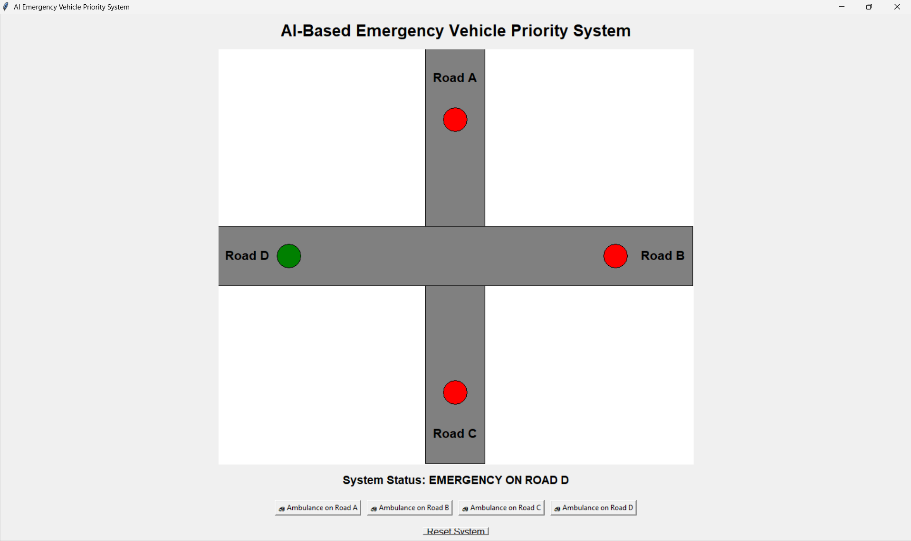

# 🚨 SIREN

### Smart Intelligent Response for Emergency Vehicle Navigation

**SIREN** is an AI-powered multimodal traffic management system that combines **Computer Vision and Audio Signal Processing** to detect emergency vehicles in real time and dynamically prioritize traffic signals.

By analyzing **live camera footage and audio input**, SIREN identifies the road from which an emergency vehicle is approaching and automatically assigns **traffic signal priority**, creating a simulated **green corridor** for faster emergency response.

> 🎥 **Live Demo:** [](https://drive.google.com/file/d/1qDy2YgBJuH7FC8XmZSU_e0BYKzvSqbT-/view?usp=drive_link)

---

# 🌟 Overview

Traffic congestion can significantly delay emergency vehicles such as ambulances, fire trucks, and police vehicles.

SIREN addresses this problem by combining two independent AI systems:

* 🚑 **Emergency Vehicle Detection** using YOLO
* 🚨 **Siren Detection** using audio classification

The outputs from both models are passed into a **Multimodal Decision Engine**, which determines:

1. Whether an emergency vehicle is present.
2. Whether a siren is detected.
3. **Which road the emergency vehicle is approaching from.**
4. Whether that road should receive traffic signal priority.

The system divides the camera's field of view into **four road zones — A, B, C, and D**. Emergency vehicle detections are associated with one of these zones, allowing the system to determine which direction should receive the green signal.

---

# 🎯 Key Features

* ✅ Real-time Emergency Vehicle Detection
* ✅ Real-time Siren Detection
* ✅ Multimodal AI Fusion — Vision + Audio
* ✅ Four-Zone Road Detection — A, B, C, D
* ✅ Intelligent Road Priority Selection
* ✅ Dynamic Traffic Signal Prioritization
* ✅ Live Webcam Monitoring
* ✅ Traffic Signal Simulation
* ✅ Emergency Confidence Scoring
* ✅ Low-Latency Decision Making
* ✅ Smart City-Oriented Architecture

---

# 🛣️ Intelligent Road Priority System

One of the key components of SIREN is determining **which road should receive priority**.

The camera view is divided into **four sections**, representing four different incoming roads.

```text
                    CAMERA VIEW

        ┌─────────────────┬─────────────────┐
        │                 │                 │
        │       ROAD A    │      ROAD B     │
        │                 │                 │
        │        🚑       │                 │
        │                 │                 │
        ├─────────────────┼─────────────────┤
        │                 │                 │
        │       ROAD C    │      ROAD D     │
        │                 │                 │
        │                 │       🚑        │
        │                 │                 │
        └─────────────────┴─────────────────┘

             Four Traffic Directions
```

Each detected emergency vehicle is mapped to one of these zones based on its **bounding-box position** within the camera frame.

### Zone Mapping

| Zone  | Road                |
| ----- | ------------------- |
| 🅰️ A | Top-left region     |
| 🅱️ B | Top-right region    |
| 🅲️ C | Bottom-left region  |
| 🅳️ D | Bottom-right region |

The system continuously monitors these four zones and determines where emergency activity is occurring.

---

# 🧠 How Road Priority Is Decided

The decision process works in multiple stages.

### Step 1 — Detect Emergency Vehicle

The YOLO-based vehicle detection model processes the camera feed and detects emergency vehicles.

For every detection, the system obtains:

* Bounding box coordinates
* Vehicle class
* Detection confidence
* Center point of the detected vehicle

For a bounding box:

```text
(x1, y1) ──────────────
   │                    │
   │       🚑           │
   │                    │
   ───────────────── (x2,y2)

Center:

cx = (x1 + x2) / 2
cy = (y1 + y2) / 2
```

The center point `(cx, cy)` is then used to determine which road zone contains the vehicle.

---

### Step 2 — Determine the Road Zone

The camera frame is divided into four regions.

Conceptually:

```text
                 FRAME WIDTH
        ←────────────────────────→

        ┌─────────────┬─────────────┐
        │             │             │
        │      A      │      B      │
        │             │             │
        ├─────────────┼─────────────┤
        │             │             │
        │      C      │      D      │
        │             │             │
        └─────────────┴─────────────┘

                  CAMERA
```

The system compares the vehicle's center coordinates against the boundaries of these regions.

For example:

```text
if cx < frame_width / 2 and cy < frame_height / 2:
        Road = A

if cx >= frame_width / 2 and cy < frame_height / 2:
        Road = B

if cx < frame_width / 2 and cy >= frame_height / 2:
        Road = C

if cx >= frame_width / 2 and cy >= frame_height / 2:
        Road = D
```

This allows the system to associate an emergency vehicle with a specific road.

---

# 🚨 Step 3 — Siren Verification

Visual detection alone is not sufficient.

The microphone continuously captures environmental audio and the siren detection model determines whether an emergency siren is present.

The decision engine combines:

```text
        🚑 Vehicle Detection
                 +
          🚨 Siren Detection
                 ↓
       Multimodal Confirmation
                 ↓
       Emergency Confidence
```

If both signals indicate an emergency vehicle, the confidence of the emergency event increases.

This multimodal approach helps reduce false positives caused by:

* Non-emergency vehicles
* Objects visually similar to emergency vehicles
* Background traffic noise
* Other environmental sounds

---

# 🚦 Step 4 — Selecting the Priority Road

Once an emergency vehicle has been detected and verified, the decision engine determines its corresponding road zone.

For example:

```text
Vehicle detected in Zone A
          +
Siren detected
          ↓
   HIGH CONFIDENCE
          ↓
   ROAD A PRIORITY
          ↓
   🟢 ROAD A GREEN
```

Similarly:

```text
Zone B → Road B receives priority

Zone C → Road C receives priority

Zone D → Road D receives priority
```

The traffic controller then switches the corresponding simulated signal to **priority mode**.

---

# 🚦 Traffic Signal Prioritization

The overall process can be represented as:

```text
Camera + Microphone
        │
        ▼
┌───────────────────────┐
│ Emergency Vehicle AI  │
│       YOLO            │
└───────────┬───────────┘
            │
            ▼
     Vehicle Detected
            │
            ▼
     Determine Zone
      A / B / C / D
            │
            │
Microphone ─┤
            ▼
┌───────────────────────┐
│   Siren Detection AI  │
└───────────┬───────────┘
            │
            ▼
┌───────────────────────┐
│   Multimodal Fusion   │
│   Decision Engine     │
└───────────┬───────────┘
            │
            ▼
   Emergency Confirmed
            │
            ▼
┌───────────────────────┐
│ Traffic Controller    │
│ Select Priority Road  │
└───────────┬───────────┘
            │
            ▼
      🟢 GREEN SIGNAL
            │
            ▼
     Emergency Vehicle
       Given Priority
```

---

# 🏗️ System Architecture

```text
              ┌──────────────────┐
              │   Camera Feed    │
              └────────┬─────────┘
                       │
                       ▼
              ┌──────────────────┐
              │ Vehicle Detection│
              │     YOLO         │
              └────────┬─────────┘
                       │
                       ▼
                Zone Detection
                 A / B / C / D
                       │
                       │
                       ▼
              ┌──────────────────┐
              │  Decision Engine │◄──────────────┐
              └────────┬─────────┘               │
                       │                          │
                       │                   ┌──────┴───────┐
                       │                   │ Microphone   │
                       │                   └──────┬───────┘
                       │                          │
                       │                          ▼
                       │                   ┌──────────────┐
                       │                   │ Siren Model  │
                       │                   └──────┬───────┘
                       │                          │
                       └──────────────────────────┘
                                  │
                                  ▼
                        Emergency Confirmed
                                  │
                                  ▼
                       Traffic Signal Controller
                                  │
                                  ▼
                         Priority Road Selected
                                  │
                                  ▼
                           GREEN CORRIDOR
```

---

# ⚙️ How It Works

### Step 1 — Video Analysis

The webcam continuously captures road traffic footage.

The vehicle detection module:

* Captures video frames
* Performs object detection using YOLO
* Identifies emergency vehicles
* Extracts bounding-box coordinates
* Calculates the vehicle center point
* Determines the corresponding road zone

Supported emergency vehicle categories can include:

* 🚑 Ambulances
* 🚒 Fire Trucks
* 🚓 Police Vehicles

---

### Step 2 — Audio Analysis

The microphone continuously captures ambient traffic audio.

The siren detection module:

* Captures audio segments
* Preprocesses the audio
* Extracts relevant audio features
* Classifies the audio
* Detects emergency siren patterns

---

### Step 3 — Multimodal Fusion

The outputs of the visual and audio models are combined.

```text
Vehicle Detection ─────┐
                       ├──► Decision Engine
Siren Detection ───────┘
                              │
                              ▼
                    Emergency Confidence
```

A stronger emergency indication is produced when the visual and audio signals agree.

---

### Step 4 — Road Selection

The detected vehicle's location determines the priority road.

```text
        ┌─────────────┬─────────────┐
        │      A      │      B      │
        │             │             │
        ├─────────────┼─────────────┤
        │      C      │      D      │
        │             │             │
        └─────────────┴─────────────┘
                 ▲
                 │
          Emergency Vehicle
                 │
                 ▼
          Corresponding
           Road Selected
```

---

### Step 5 — Traffic Signal Control

When the emergency confidence exceeds the configured threshold:

```text
Priority Mode Activated
          ↓
Priority Road Identified
          ↓
Corresponding Signal → GREEN
          ↓
Emergency Vehicle Gets Right-of-Way
          ↓
Vehicle Passes
          ↓
Normal Signal Operation Resumes
```

---

# 🧠 Technologies Used

### Programming

* Python

### Computer Vision

* OpenCV
* YOLO
* PyTorch

### Audio Processing

* Librosa
* NumPy

### Interface

* Tkinter

### AI Techniques

* Object Detection
* Audio Classification
* Multimodal AI
* Confidence-Based Decision Making
* Real-Time Inference

---

# 📂 Project Structure

```text
SIREN/
│
├── src/
│   ├── main.py
│   ├── vehicle_detector.py
│   ├── siren_detector.py
│   ├── traffic_controller.py
│   └── decision_engine.py
│
├── models/
│   ├── vehicle_model.pt
│   └── siren_model.pth
│
├── architecture/
│   └── siren_model_architecture.png
│
├── assets/
│   └── demo.png
│
├── requirements.txt
└── README.md
```

---

# 📊 Datasets

### 🚑 Emergency Vehicle Detection Dataset

[Ambulance Detection Dataset — Roboflow](https://universe.roboflow.com/yolo-emergency-recognition/ambulance-detection-wdbvs/dataset/1)

### 🚨 Siren Audio Detection Dataset

[UrbanSound8K — Kaggle](https://www.kaggle.com/datasets/chrisfilo/urbansound8k)

---

# 🤖 Model Weights

Due to GitHub file-size limitations, trained model weights for the siren detector are not included in this repository.

The required model files should be placed inside the `models/` directory.

---

# 🚀 Installation

Clone the repository:

```bash
git clone https://github.com/Hemanth-K-9625/SIREN---Smart-Intelligent-Response-for-Emergency-Vehicle-Navigation
cd SIREN---Smart-Intelligent-Response-for-Emergency-Vehicle-Navigation
```

Install dependencies:

```bash
pip install -r requirements.txt
```

---

# ▶️ Running the Project

```bash
python src/main.py
```

The system starts the webcam and microphone processing pipeline and begins real-time emergency vehicle and siren detection.

---

# 📈 Applications

* 🏙️ Smart Cities
* 🚦 Intelligent Transportation Systems
* 🚑 Emergency Response Infrastructure
* 🛣️ Urban Traffic Optimization
* 🤖 AI-Based Traffic Management
* 🚥 Smart Intersections
* 🚨 Emergency Vehicle Priority Systems

---

# 🔬 Future Improvements

* Multi-Intersection Coordination
* Vehicle Tracking Across Multiple Cameras
* More Advanced Road/Direction Mapping
* Edge AI Deployment
* Real Traffic Signal Hardware Integration
* Cloud Monitoring Dashboard
* Emergency Route Prediction
* GPS Integration with Emergency Vehicles
* Automatic Green-Corridor Coordination Across Intersections

---

# 📸 Demo

### System Running


### 🎥 Video Demonstration

> **Live Demo:** [Watch the SIREN System Demo](https://drive.google.com/file/d/1qDy2YgBJuH7FC8XmZSU_e0BYKzvSqbT-/view?usp=drive_link)

The demonstration shows:

* Real-time vehicle detection
* Siren detection
* Road-zone identification
* Multimodal emergency verification
* Priority road selection
* Traffic signal simulation
* Emergency signal activation

---

# 🏆 Project Highlights

### 🚨 Multimodal Emergency Detection

Combines **visual and audio AI** to improve emergency vehicle identification.

### 🛣️ Intelligent Road Selection

Divides the camera view into **four road zones (A, B, C, D)** and determines which road contains the approaching emergency vehicle.

### 🚦 Dynamic Traffic Priority

Automatically assigns traffic signal priority to the detected emergency vehicle's road.

### ⚡ Real-Time Processing

Designed for low-latency inference using live camera and microphone streams.

### 🏙️ Smart City Application

Demonstrates how AI can be integrated into intelligent transportation infrastructure.

### 🔗 End-to-End AI Pipeline

Combines:

**Computer Vision → Audio AI → Multimodal Fusion → Road Selection → Traffic Control**

---

# 👨‍💻 Author

**Hemanth Kumar K**

Passionate about Artificial Intelligence, Computer Vision, and Intelligent Transportation Systems.

---

# ⭐ Support

If you found **SIREN** interesting, consider giving the repository a ⭐ to support the project and future development.
